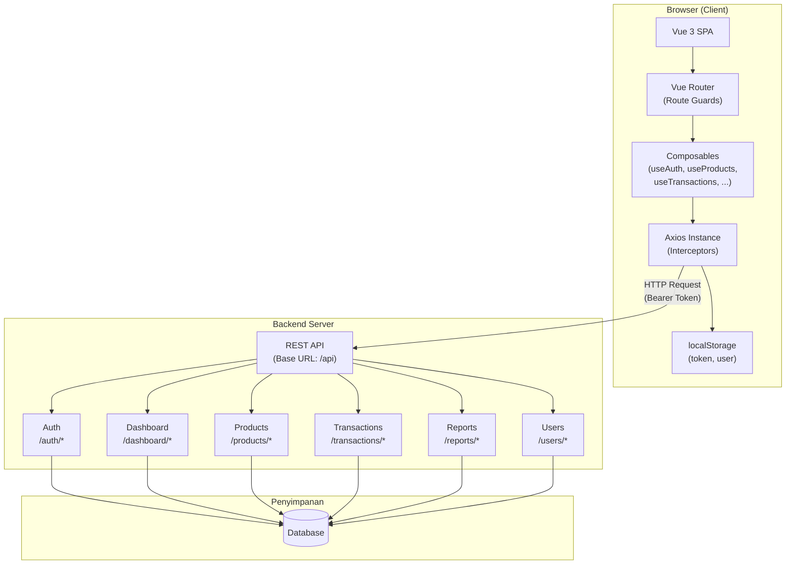
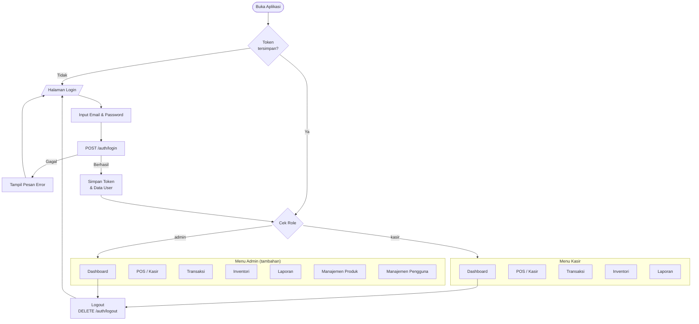
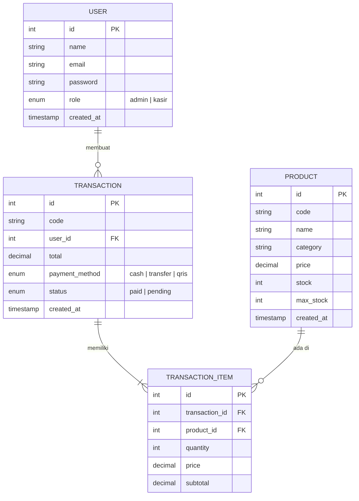
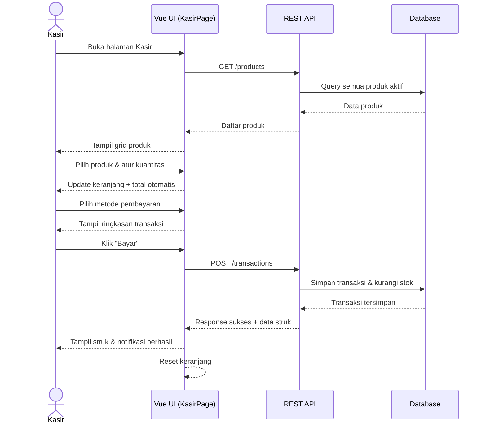

# KasirKu — Product Requirements Document


---

## Daftar Isi

- [Overview](#overview)
- [Latar Belakang & Masalah](#latar-belakang--masalah)
- [Target Pengguna](#target-pengguna)
- [Fitur Utama](#fitur-utama)
- [Tech Stack](#tech-stack)
- [Arsitektur Sistem](#arsitektur-sistem)
- [Alur Pengguna](#alur-pengguna)
- [Entity Relationship](#entity-relationship)
- [Alur Transaksi POS](#alur-transaksi-pos)
- [Halaman & Rute](#halaman--rute)
- [API Endpoints](#api-endpoints)
- [Struktur Folder](#struktur-folder)
- [Cara Menjalankan](#cara-menjalankan)
- [Pengembangan Selanjutnya](#pengembangan-selanjutnya)

---

## Overview

**KasirKu** adalah aplikasi Point of Sale (POS) berbasis web yang dirancang khusus untuk kebutuhan Usaha Mikro, Kecil, dan Menengah (UMKM) di Indonesia. Aplikasi ini menyediakan solusi lengkap untuk mengelola transaksi penjualan, stok produk, laporan keuangan, dan manajemen pengguna dalam satu platform yang ringan dan mudah digunakan.

---

## Latar Belakang & Masalah

Banyak UMKM di Indonesia masih mengelola transaksi dan stok secara manual (buku kas, spreadsheet) yang rentan terhadap kesalahan pencatatan, sulit dilacak, dan tidak efisien. KasirKu hadir untuk menjawab kebutuhan tersebut dengan solusi digital yang:

- Mudah dipelajari oleh kasir tanpa latar belakang teknis
- Dapat diakses dari browser tanpa perlu instalasi aplikasi
- Menyajikan laporan penjualan secara real-time
- Mendukung multi-user dengan kontrol akses berbasis peran

---

## Target Pengguna

| Peran     | Deskripsi                                                             |
| --------- | --------------------------------------------------------------------- |
| **Kasir** | Staf yang bertugas melayani transaksi harian di counter               |
| **Admin** | Pemilik atau manajer bisnis yang mengelola produk, stok, dan pengguna |

---

## Fitur Utama

### Kasir

- Login aman dengan token autentikasi
- Dashboard ringkasan statistik bisnis (pendapatan, transaksi, stok rendah)
- POS — cari produk, tambah ke keranjang, pilih metode pembayaran, cetak struk
- Lihat riwayat transaksi dengan filter status
- Monitor stok produk secara real-time
- Lihat laporan penjualan & grafik performa
- Filter riwayat transaksi berdasarkan periode (harian, mingguan, bulanan)
- Ekspor riwayat transaksi ke CSV (harian, mingguan, bulanan)

### Admin

- Semua fitur Kasir
- Manajemen produk (CRUD + penyesuaian stok)
- Manajemen pengguna & role (CRUD + reset password)
- Akses ke seluruh data dan konfigurasi sistem

---

## Tech Stack

| Kategori       | Teknologi                 | Versi |
| -------------- | ------------------------- | ----- |
| Framework UI   | Vue.js                    | 3.x   |
| Build Tool     | Vite                      | 8.x   |
| Routing        | Vue Router                | 5.x   |
| HTTP Client    | Axios                     | 1.x   |
| Styling        | Tailwind CSS              | 3.x   |
| Visualisasi    | Chart.js                  | 4.x   |
| API Mock (dev) | Mock Service Worker (MSW) | 2.x   |
| CSS Processing | PostCSS + Autoprefixer    | 8.x   |

---

## Arsitektur Sistem



---

## Alur Pengguna



---

## Entity Relationship



---

## Alur Transaksi POS



---

## Halaman & Rute

| Halaman            | Rute                  | Akses        | Deskripsi                      |
| ------------------ | --------------------- | ------------ | ------------------------------ |
| Login              | `/login`              | Public       | Autentikasi pengguna           |
| Dashboard          | `/`                   | Kasir, Admin | Statistik ringkas & alert stok |
| POS / Kasir        | `/kasir`              | Kasir, Admin | Interface transaksi penjualan  |
| Transaksi          | `/transaksi`          | Kasir, Admin | Riwayat & filter transaksi     |
| Inventori          | `/inventori`          | Kasir, Admin | Monitor stok semua produk      |
| Laporan            | `/laporan`            | Kasir, Admin | Grafik & laporan penjualan     |
| Manajemen Produk   | `/manajemen-produk`   | Admin Only   | CRUD produk & stok             |
| Manajemen Pengguna | `/manajemen-pengguna` | Admin Only   | CRUD user & role               |

---

## API Endpoints

### Autentikasi

| Method | Endpoint       | Deskripsi           |
| ------ | -------------- | ------------------- |
| POST   | `/auth/login`  | Login pengguna      |
| POST   | `/auth/logout` | Logout pengguna     |
| GET    | `/auth/me`     | Info pengguna aktif |

### Dashboard

| Method | Endpoint                         | Deskripsi           |
| ------ | -------------------------------- | ------------------- |
| GET    | `/dashboard/stats`               | Statistik ringkas   |
| GET    | `/dashboard/recent-transactions` | 5 transaksi terbaru |
| GET    | `/dashboard/low-stock`           | Produk stok rendah  |

### Produk

| Method | Endpoint              | Deskripsi           |
| ------ | --------------------- | ------------------- |
| GET    | `/products`           | Daftar semua produk |
| POST   | `/products`           | Tambah produk baru  |
| PUT    | `/products/:id`       | Update produk       |
| DELETE | `/products/:id`       | Hapus produk        |
| PATCH  | `/products/:id/stock` | Sesuaikan stok      |

### Transaksi

| Method | Endpoint                   | Deskripsi               |
| ------ | -------------------------- | ----------------------- |
| GET    | `/transactions`            | Daftar transaksi        |
| POST   | `/transactions`            | Buat transaksi baru     |
| PATCH  | `/transactions/:id/status` | Update status transaksi |

### Laporan

| Method | Endpoint              | Deskripsi                |
| ------ | --------------------- | ------------------------ |
| GET    | `/reports/summary`    | Ringkasan laporan        |
| GET    | `/reports/by-payment` | Laporan per metode bayar |

### Pengguna

| Method | Endpoint              | Deskripsi            |
| ------ | --------------------- | -------------------- |
| GET    | `/users`              | Daftar pengguna      |
| POST   | `/users`              | Tambah pengguna baru |
| PUT    | `/users/:id`          | Update pengguna      |
| DELETE | `/users/:id`          | Hapus pengguna       |
| PATCH  | `/users/:id/password` | Ganti password       |

> Semua endpoint (kecuali `/auth/login`) memerlukan header `Authorization: Bearer <token>`.

---

## Struktur Folder

```
kasirku.v1/
├── public/
├── src/
│   ├── assets/              # Gambar, font, ikon
│   ├── components/          # Komponen UI reusable
│   │   ├── Sidebar.vue
│   │   ├── Topbar.vue
│   │   ├── StatCard.vue
│   │   ├── StatusBadge.vue
│   │   ├── StokBar.vue
│   │   └── LaporanChart.vue
│   ├── composables/         # Business logic (Vue Composables)
│   │   ├── useAuth.js
│   │   ├── useApi.js
│   │   ├── useDashboard.js
│   │   ├── useProducts.js
│   │   ├── useTransactions.js
│   │   ├── useReports.js
│   │   ├── useUsers.js
│   │   └── useNotif.js
│   ├── layouts/
│   │   └── AuthLayout.vue   # Layout dengan sidebar & topbar
│   ├── mocks/               # MSW mock API (development)
│   ├── pages/               # Halaman utama
│   │   ├── LoginPage.vue
│   │   ├── BerandaPage.vue
│   │   ├── KasirPage.vue
│   │   ├── TransaksiPage.vue
│   │   ├── InventoriPage.vue
│   │   ├── LaporanPage.vue
│   │   ├── ManajemenProdukPage.vue
│   │   └── ManajemenPenggunaPage.vue
│   ├── router/              # Konfigurasi Vue Router + route guards
│   ├── utils/               # Helper & konstanta
│   │   ├── exportCsv.js     # Export transaksi ke CSV (harian/mingguan/bulanan)
│   │   ├── format.js        # Format rupiah & utilitas lain
│   │   └── icons.js         # Kumpulan ikon SVG
│   ├── App.vue
│   ├── main.js
│   └── style.css
├── .env                     # Konfigurasi environment
├── index.html
├── package.json
├── tailwind.config.js
└── vite.config.js
```

---

## Cara Menjalankan

### Prasyarat

- Node.js >= 18
- npm >= 9
- Backend API berjalan (atau gunakan mode mock)

### Instalasi

```bash
# Clone repository
git clone <repo-url>
cd kasirku.v1

# Install dependencies
npm install
```

### Menjalankan Dev Server

```bash
npm run dev
```

Buka [http://localhost:5173](http://localhost:5173) di browser.

### Build Production

```bash
npm run build
npm run preview   # Preview hasil build
```

---

## Pengembangan Selanjutnya

| Fitur                      | Prioritas | Deskripsi                                           |
| -------------------------- | --------- | --------------------------------------------------- |
| Ekspor Laporan (PDF/Excel) | Sedang    | Download laporan penjualan dalam format PDF / Excel (CSV sudah tersedia) |
| Manajemen Kategori Produk  | Sedang    | CRUD kategori produk yang dinamis                   |
| Diskon & Promo             | Sedang    | Fitur potongan harga per produk atau transaksi      |
| Multi-Outlet               | Rendah    | Dukungan beberapa cabang dalam satu akun            |
| Notifikasi Stok Otomatis   | Sedang    | Push notification saat stok mendekati batas minimum |
| Mode Offline               | Rendah    | Transaksi tetap berjalan saat koneksi terputus      |
| Barcode Scanner            | Sedang    | Input produk via scan barcode di KasirPage          |

---

<div align="center">
  <sub>Dibuat dengan Vue 3 + Vite · KasirKu v1</sub>
</div>
